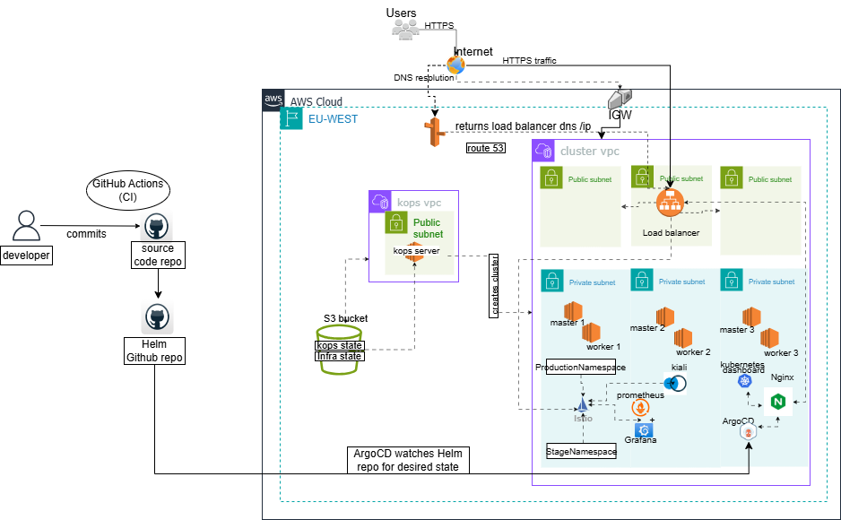

# Microservices E‑Commerce Platform (Kubernetes + CI/CD)

This repository contains a **cloud‑native microservices e‑commerce application** deployed on **Kubernetes** and automated with **GitHub Actions CI** and **Helm‑based GitOps**. The system is composed of **13 independent services**, each built, containerized, and deployed independently.

---

## Architecture Overview


_This diagram represents the high-level system architecture, focusing on ingress traffic flow, GitOps-based CI/CD, and cluster layout._

* **Microservices**: 13 loosely coupled services (frontend, cartservice, checkoutservice, paymentservice, etc.)
* **Containerization**: Docker
* **Orchestration**: Kubernetes
* **Ingress**: NGINX Ingress Controller with TLS (cert‑manager + Let’s Encrypt)
* **CI/CD**: GitHub Actions + Argo CD (GitOps)
* **Deployment Strategy**: Helm charts stored in a separate Git repository (GitOps style)
* **Image Registry**: Docker Hub

---

## Services

The platform consists of the following services:

* adservice
* cartservice
* checkoutservice
* currencyservice
* emailservice
* frontend
* loadgenerator
* paymentservice
* productcatalogueservice
* recommendationservice
* shippingservice

Each service:

* Has its own directory
* Contains its own Dockerfile (where applicable)
* Is built and deployed independently

---

## Example Service: Cart Service Deployment

Below is a sample Kubernetes deployment used by one of the services (`cartservice`):

```yaml
apiVersion: apps/v1
kind: Deployment
metadata:
  name: cartservice
spec:
  selector:
    matchLabels:
      app: cartservice
  template:
    metadata:
      labels:
        app: cartservice
    spec:
      serviceAccountName: default
      terminationGracePeriodSeconds: 5
      containers:
      - name: server
        image: olasunkanmi12/cartservice:1
        ports:
        - containerPort: 7070
        env:
        - name: REDIS_ADDR
          value: "redis-cart:6379"
        resources:
          requests:
            cpu: 200m
            memory: 64Mi
          limits:
            cpu: 300m
            memory: 128Mi
        readinessProbe:
          initialDelaySeconds: 15
          exec:
            command: ["/bin/grpc_health_probe", "-addr=:7070", "-rpc-timeout=5s"]
        livenessProbe:
          initialDelaySeconds: 15
          periodSeconds: 10
          exec:
            command: ["/bin/grpc_health_probe", "-addr=:7070", "-rpc-timeout=5s"]
```

---

## Frontend Exposure

### Frontend Service (Internal)

```yaml
apiVersion: v1
kind: Service
metadata:
  name: frontend
spec:
  type: NodePort
  selector:
    app: frontend
  ports:
  - name: http
    port: 80
    targetPort: 8080
```

### Frontend External LoadBalancer

```yaml
apiVersion: v1
kind: Service
metadata:
  name: frontend-external
spec:
  type: LoadBalancer
  selector:
    app: frontend
  ports:
  - name: http
    port: 80
    targetPort: 8080
```

---

## Ingress Configuration

The application is exposed to the internet via **NGINX Ingress** with **TLS enabled** using cert‑manager.

```yaml
apiVersion: networking.k8s.io/v1
kind: Ingress
metadata:
  name: frontend-ingress
  namespace: default
  annotations:
    cert-manager.io/cluster-issuer: letsencrypt-prod
spec:
  ingressClassName: nginx
  tls:
    - hosts:
        - www.alasoasiko.co.uk
      secretName: frontend-tls
  rules:
    - host: www.alasoasiko.co.uk
      http:
        paths:
          - path: /
            pathType: Prefix
            backend:
              service:
                name: frontend-external
                port:
                  number: 80
```

---

## CI/CD Pipeline (Gitops)


This project follows a GitOps-based CI/CD workflow, with a clear separation between Continuous Integration (CI) and Continuous Deployment (CD).

### CI – GitHub Actions

Each microservice lives in its own directory within the source code repository. A matrix-based GitHub Actions workflow is used to efficiently process only the services that have changed.

#### CI flow:

1. A developer pushes code to the main branch.
2. GitHub Actions detects which service directory has changed.
3. Only the affected service is selected from the matrix.
4. A new Docker image is built for that service.
5. The image is tagged using the commit SHA and branch name.
6. The image is pushed to Docker Hub.
7. The pipeline checks out the Helm repository.
8. The image tag in the relevant deployment.yaml is updated.
9. The updated Helm manifest is committed and pushed back to Git.

This ensures CI is responsible only for building new images and updating the desired state in Git, not deploying directly to Kubernetes.

#### CD – Argo CD (GitOps Reconciliation)

Continuous Deployment is handled by Argo CD, which continuously monitors the Helm repository for changes.

Each microservice is represented by an Argo CD Application resource that defines:

1. The Git repository to watch
2. The target branch
3. The service-specific path
4. The destination cluster and namespace

Example Argo CD Application:
```yaml

apiVersion: argoproj.io/v1alpha1
kind: Application
metadata:
  name: cartservice
  namespace: argocd
spec:
  project: default
  source:
    repoURL: 'https://github.com/Olasunkanmi-O/e-commerce-helm'
    targetRevision: main
    path: cartservice
  destination:
    server: 'https://kubernetes.default.svc'
    namespace: default
  syncPolicy:
    automated:
      prune: true
      selfHeal: true
```
_Argo CD does not monitor container registries directly. Git remains the single source of truth for deployments._

CD flow:

1. Argo CD detects a commit in the Helm repository.
2. It compares the desired state in Git with the live cluster state.
3. If drift is detected (e.g. a new image tag), Argo CD automatically synchronizes.
4. Kubernetes performs a rolling update using the new image.


---

## Domain & TLS

* Domain: `www.alasoasiko.co.uk`
* TLS: Let’s Encrypt (cert‑manager)
* Automatic certificate issuance and renewal<br>
_TLS termination is handled at the NGINX Ingress layer using cert-manager._

---

## Key DevOps Concepts Demonstrated

* Microservices architecture
* Kubernetes deployments, services, and ingress
* Health probes (liveness & readiness)
* Resource requests and limits
* Secure TLS ingress
* CI/CD with GitHub Actions
* GitOps using Helm

---

## Status

The platform is actively evolving, with all services independently deployable and production‑ready.

---

## Author

**Ola Owolabi**
DevOps Engineer
